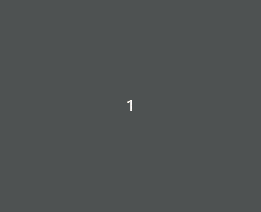

# Boggle

A simple and interesting puzzle to find the hidden Dutch words from the scattered letters.



## Getting Started

These instructions will get you a copy of the project up and running on your local machine for development and testing purposes.

### Installing

Clone Git repository

```
git clone https://github.com/nickyvanurk/boggle.git
```

Install required npm modules

```
npm run install:client
npm run install:server
```

Start the client and server

```
npm run start:client
npm run start:server
```

Surf to [localhost:8000](http://localhost:8000)!

## Built With

* [React](https://reactjs.org/) - The UI library used
* [Node](https://nodejs.org/en/about/) A JavaScript runtime
* [Express](https://expressjs.com/) - The web framework used for the API

## License

This project is licensed under the [MIT License](./LICENSE.md).
